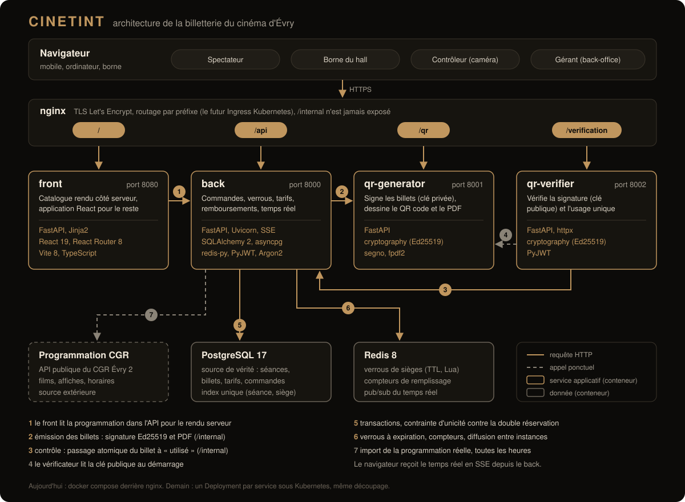
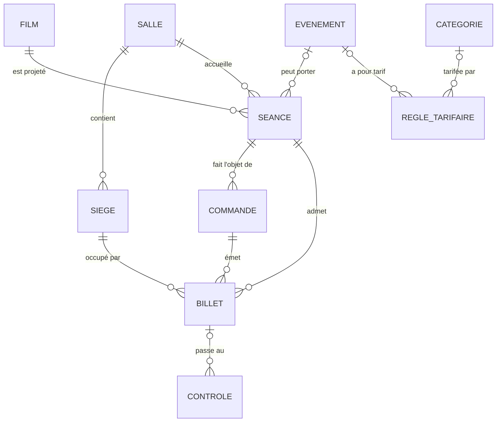

# CinetINT, billetterie en ligne du cinéma d'Évry

Projet d'architecture web, FISA 2028 (Télécom SudParis, septembre 2026).
Groupe **CinetINT** : [@aztrooow](https://github.com/aztrooow), [@Adurnea](https://github.com/Adurnea), [@eldertek](https://github.com/eldertek).

Version en ligne : **https://fisa.eclipse-technology.eu**

| Page | Adresse |
|---|---|
| Programme et réservation | [/](https://fisa.eclipse-technology.eu/) |
| Borne du hall (mode kiosque) | [/borne](https://fisa.eclipse-technology.eu/borne) |
| Contrôle des billets | [/controle](https://fisa.eclipse-technology.eu/controle) |
| Espace gérant | [/admin](https://fisa.eclipse-technology.eu/admin) |
| Documentation de l'API | [/api/docs](https://fisa.eclipse-technology.eu/api/docs) |

Documentation technique : [docs/architecture.md](docs/architecture.md) (schéma, technologies, échanges entre services, données, déploiement).

---

## 1. Résumé du besoin

Le cinéma d'Évry exploite **6 salles d'environ 300 places** sur un emplacement très fréquenté. La vente se fait aujourd'hui uniquement sur des **bornes locales** : il n'existe ni système en ligne, ni infrastructure exploitable, et le site actuel ne supporterait pas la charge. On part donc de zéro.

Le gérant a exprimé deux problèmes concrets.

**Les pics d'affluence.** Le week-end, et plus encore lors d'événements comme la Paris Games Week, la file d'attente devant les bornes devient le goulot d'étranglement : le nombre de bornes plafonne le nombre de ventes et des spectateurs repartent sans billet.

**Le manque de pilotage.** Le gérant n'a aucune vue en temps réel sur le remplissage de ses séances, et rien ne garantit qu'un billet présenté à l'entrée est authentique.

La billetterie en ligne répond aux deux : elle sort la vente des bornes (la capacité de vente n'est plus limitée par le matériel) et elle rend le billet contrôlable.

| Objectif métier | Réponse technique |
|---|---|
| Vendre en ligne et absorber les pics | Services sans état, multipliables, verrous de sièges dans Redis |
| Garantir l'authenticité des billets | Billet signé en Ed25519, vérifié au scan |
| Piloter le remplissage | Tableau de bord mis à jour en direct (Server-Sent Events) |
| Gérer une tarification variable | Moteur de règles, aucun tarif écrit dans le code |
| Ne plus dépendre des bornes | La borne devient un client du système parmi d'autres |

### Ce que le client a tranché

| Décision | Conséquence sur la conception |
|---|---|
| **Pas de revente** entre particuliers | Aucun transfert de propriété d'un billet |
| **Pas de modification** de billet | Un changement = remboursement puis nouvel achat. Un seul chemin à tester |
| **Billet non nominatif** mais identifiable | On authentifie le billet, pas le porteur : aucune donnée personnelle |
| **Pas de compte client** | Le billet s'affiche après paiement et se télécharge en PDF ; la commande se retrouve par son lien |
| **Paiement** par le prestataire existant du cinéma | Aucune donnée de carte ne passe par nos services |
| **Remboursement oui**, modification non | Remboursement refusé une fois le billet scanné |
| **Tarif unique** pour un événement (ex. « Terminator grandeur nature ») | Règle de priorité maximale, visible dans l'application avant paiement |

### Acteurs

| Acteur | Besoin principal | Contrainte |
|---|---|---|
| **Spectateur** | Choisir une séance et ses places, payer, recevoir son billet | Depuis n'importe quel écran, sans compte |
| **Borne** | Même parcours d'achat, sur place | Mode kiosque, écran tactile |
| **Contrôleur** | Scanner un billet et avoir un verdict immédiat | Doit continuer à fonctionner si la billetterie tombe |
| **Gérant** | Programmer, fixer les tarifs, suivre le remplissage, rembourser | Accès protégé |

### Exigences non fonctionnelles

| Exigence | Cible | Pourquoi |
|---|---|---|
| **Charge** | environ 1 800 places mises en vente en même temps, pics le week-end | L'ouverture des ventes d'un événement concentre la demande sur quelques minutes |
| **Cohérence** | **aucune double réservation**, même sous forte concurrence | Deux spectateurs sur le même siège, c'est un incident en salle |
| **Performance** | plan de salle en moins de 500 ms, scan en moins de 200 ms | Un scan lent recrée la file d'attente qu'on veut supprimer |
| **Disponibilité** | le contrôle d'entrée continue si la billetterie est injoignable | Une panne ne doit pas bloquer l'entrée d'une salle pleine |
| **Adaptabilité** | mobile, tablette, ordinateur, borne tactile | Demande explicite du client |
| **Sécurité** | billet infalsifiable, aucune donnée de carte stockée | Stocker des cartes imposerait la conformité PCI-DSS au cinéma |

---

## 2. Fonctionnalités

**Spectateur**
- Programme de la semaine, fiche de chaque film avec ses séances par jour.
- Plan de salle mis à jour en direct : un siège réservé par quelqu'un d'autre se grise sans recharger la page.
- Choix de 1 à 10 places, catégorie de tarif par place (plein, étudiant, moins de 14 ans, senior), prix et libellé du tarif affichés avant le paiement.
- Places bloquées 10 minutes pendant le paiement, puis remises en vente automatiquement.
- Billets avec QR code signé, affichés après paiement et téléchargeables en PDF.
- Remboursement en ligne jusqu'à une heure avant la séance, refusé si le billet a déjà été scanné.

**Borne** : la même application en mode kiosque (`/borne`), grands boutons, retour automatique au programme.

**Contrôleur** (`/controle`) : lecture du QR code à la caméra ou saisie du code, verdict plein écran lisible de loin (entrée validée, déjà utilisé, remboursé, faux billet), historique des derniers passages.

**Gérant** (`/admin`)
- Remplissage de chaque séance en direct, chiffres du jour (taux de remplissage, billets vendus, recette, entrées).
- Programmation : ajout et suppression de séances (la salle doit être libre, ménage compris), gestion des films.
- Grille tarifaire : règles, catégories de spectateurs, événements.
- Recherche d'une commande par référence et remboursement.
- Journal du contrôle d'entrée (repasses et faux billets compris).
- Réglages : durée du blocage des places, nombre maximum de places par commande, délai de remboursement.

**Programmation réelle.** Les films, affiches, synopsis et horaires sont repris chaque heure de la programmation publique du CGR Évry 2, puis répartis sur nos six salles. Si cette source ne répond pas, la programmation en place est conservée ; s'il n'y a plus aucune séance à venir (premier démarrage sans réseau, par exemple), une semaine fictive est générée. Pour que les plans de salle ne soient pas vides à la démonstration, chaque nouvelle séance reçoit des ventes simulées, enregistrées comme des ventes aux bornes.

---

## 3. Architecture principale

Quatre services applicatifs, chacun dans son conteneur, plus PostgreSQL et Redis.



La [documentation technique](docs/architecture.md) détaille chaque service, les technologies et leurs versions, les échanges pas à pas (diagrammes de séquence), les clés Redis, la sécurité, la configuration et le passage sous Kubernetes.

| Service | Rôle | Port | Détient |
|---|---|---|---|
| **front** | Rend côté serveur l'accueil, les fiches films et la borne (rapides, lisibles par les moteurs de recherche) ; sert l'application React pour le plan de salle, le paiement, les billets, le contrôle et le back-office | 8080 | rien |
| **back** | API REST de la billetterie : catalogue, verrous de sièges, commandes, paiement, remboursements, back-office, flux temps réel | 8000 | PostgreSQL, Redis |
| **qr-generator** | Signe les billets, dessine les QR codes et le PDF | 8001 | la clé privée |
| **qr-verifier** | Vérifie la signature d'un billet puis demande au back le passage atomique de « valide » à « utilisé » | 8002 | la clé publique seulement |

Les routes `/internal/...` ne servent qu'entre services (en-tête `X-Service-Token`) et ne sont jamais exposées par le reverse proxy.

**Pourquoi séparer la génération et la vérification ?** Le vérificateur ne possède que la clé publique : il peut dire si un billet vient bien de nous, jamais en fabriquer un. Une fuite du poste de contrôle ne permet donc pas d'émettre de faux billets.

**Sans état.** Hors du mode dégradé du vérificateur, aucun service ne garde d'état en mémoire : le personnel s'authentifie par jeton JWT, les verrous de sièges et les compteurs vivent dans Redis, les événements temps réel passent par le pub/sub de Redis. N'importe quelle instance peut traiter n'importe quelle requête, ce qui permet de multiplier les instances du back le week-end.

### Choix techniques

| Composant | Choix | Justification |
|---|---|---|
| Front | Pages catalogue rendues par le serveur (Jinja), application monopage React 19 + React Router pour le reste, Vite | Le catalogue doit s'afficher vite ; le plan de salle doit se mettre à jour sans recharger |
| API | FastAPI (Python 3.13), REST + JSON, Server-Sent Events pour le temps réel | Le temps réel ne sert qu'au plan de salle et au tableau du gérant, le reste reste en REST simple |
| Base | PostgreSQL 17 | Transactions et contrainte d'unicité partielle : c'est elle qui garantit l'absence de double réservation |
| Cache | Redis 8 | Expiration automatique des clés pour les verrous, compteurs atomiques, pub/sub entre instances |
| Signature | Ed25519 (bibliothèque `cryptography`) | Signature courte (64 octets), QR code lisible, vérification sans secret partagé |
| QR et PDF | `segno`, `fpdf2` | Rendu côté serveur, rien à installer chez le spectateur |
| Conteneurs | Docker, un conteneur par service | Préparation directe au passage sous Kubernetes |

### Parcours d'un achat

1. Le spectateur choisit ses places : le back pose un verrou Redis par siège, en une seule opération atomique (script Lua), pour 10 minutes.
2. Le back crée la commande (en attente) et une session chez le prestataire de paiement.
3. Le paiement accepté, le back demande au qr-generator de signer un jeton par billet, enregistre les billets en base, libère les verrous et publie le changement d'état des sièges.
4. Le navigateur affiche les billets ; chaque QR code est dessiné par le qr-generator à partir du jeton signé.

### Parcours d'un contrôle

1. Le contrôleur scanne le QR code : le qr-verifier vérifie la signature Ed25519, sans appel réseau.
2. Si elle est bonne, il demande au back de passer le billet de « valide » à « utilisé » par une seule requête `UPDATE ... WHERE statut = 'valide'`.
3. Un second passage du même billet ne modifie plus aucune ligne : il est refusé (« déjà utilisé »).
4. Si le back ne répond plus, le vérificateur accepte sur la seule signature, refuse une seconde présentation du même billet pendant la panne, et rejoue les passages dès que le back revient.

---

## 4. Modèle de données



| Table | Rôle | Colonnes principales |
|---|---|---|
| `salles` | Les 6 salles | nom, capacité |
| `sieges` | Plan de chaque salle | rang, numéro, position x/y, accessible en fauteuil |
| `films` | Films à l'affiche | titre, réalisation, durée, genre, synopsis, type de production (standard, 3D, art et essai), affiche |
| `evenements` | Manifestations à tarif unique | nom, description |
| `seances` | Un film, une salle, un horaire | début, version (VF, VOST), événement éventuel |
| `categories` | Catégories de spectateurs | plein, étudiant, moins de 14 ans, senior |
| `regles_tarifaires` | Grille de prix | libellé, prix, priorité, critères (jours, type de production, catégorie, événement) |
| `commandes` | Un achat | référence, lignes choisies, montant, statut (en attente, payée, expirée, annulée), session du prestataire |
| `billets` | L'entité centrale | séance, siège, tarif et prix payés, statut (valide, utilisé, remboursé), jeton signé |
| `controles` | Journal du contrôle d'entrée | résultat, poste, horodatage |
| `parametres` | Réglages du gérant | durée du verrou, places maximum, délai de remboursement |
| `comptes` | Personnel | identifiant, mot de passe haché (Argon2), rôle |

Le **billet porte son propre statut et le prix réellement payé**. Le contrôle d'entrée n'a besoin de rien d'autre, et un remboursement se calcule sur le billet sans rejouer une grille tarifaire qui a pu changer entre-temps.

La contrainte qui compte : un **index unique partiel** sur `(seance_id, siege_id)` pour les billets `valide` ou `utilise`. Deux billets actifs sur la même place sont impossibles en base, même en cas de bug applicatif ; un billet remboursé libère la place.

---

## 5. Mécanismes clés

### Aucune double réservation

Un siège doit être bloqué **pendant** le paiement, sinon on le vendrait deux fois pendant que le premier acheteur saisit sa carte, mais pas indéfiniment, sinon un panier abandonné retirerait la place de la vente.

- **Le verrou à expiration.** Une clé Redis par siège (`verrou:{seance}:siege`), posée pour tous les sièges d'une commande ou pour aucun, par un script Lua exécuté atomiquement. Si le paiement échoue ou si le spectateur part, la clé expire seule.
- **La contrainte d'unicité en base.** Même si Redis tombe, la base refuse le second billet.

Le cache accélère, la base arbitre. Un test lance 25 réservations simultanées du même siège : une seule réussit.

### Authenticité du billet

Le QR code contient un jeton `CIN1.<contenu>.<signature>` : identifiant du billet, séance, place et date d'émission, signés en Ed25519. Aucune donnée personnelle. Fabriquer un faux billet supposerait de forger la signature sans la clé privée, qui ne quitte jamais le qr-generator. Le qr-generator refuse d'ailleurs de dessiner un QR code pour un jeton qu'il n'a pas signé.

L'**anti-repasse** neutralise la photo du billet envoyée à un ami : les deux présentations sont authentiques, mais la seconde est refusée parce que le billet est déjà « utilisé ».

### Moteur de tarification

Une règle associe des critères (jours de la semaine, type de production, catégorie de spectateur, événement) à un prix et à une priorité. Pour chaque place, le moteur garde les règles qui s'appliquent et retient la plus prioritaire, puis la plus précise. Le jour s'apprécie à l'heure de Paris.

« Terminator grandeur nature » est un **événement à tarif unique** de priorité maximale : il court-circuite la grille habituelle, et le tarif s'affiche avec son libellé avant le paiement. Ajouter un tel événement est une opération de back-office, pas une modification du code.

### Remplissage en temps réel

Un compteur par séance est tenu dans Redis, incrémenté à chaque vente et décrémenté à chaque remboursement ; chaque changement est publié sur un canal Redis. Chaque instance du back garde **une seule** connexion d'abonnement et redistribue les messages aux navigateurs qu'elle sert. Le compteur reste un cache : il se recalcule depuis la base, à la demande du gérant ou dès qu'il manque.

### Remboursement

Le billet passe à « remboursé », le siège redevient vendable, le compteur et le plan de salle sont mis à jour, et le remboursement est demandé au prestataire de paiement. Un billet déjà scanné n'est jamais remboursable. Le spectateur peut rembourser jusqu'à une heure avant la séance (réglable) ; le gérant peut le faire après ce délai.

### Paiement

Le cinéma a déjà un prestataire. Le back passe par une interface (`Prestataire`) avec deux opérations, créer une session de paiement et rembourser. En attendant le branchement du vrai prestataire, `PrestataireSimule` joue son rôle et une page de paiement simulée permet d'accepter ou de refuser. Aucune donnée de carte n'est saisie ni stockée.

---

## 6. Points de terminaison de l'API

La documentation interactive de chaque service est générée par FastAPI : `/api/docs`, `/qr/docs`, `/verification/docs`.

### back, public

| Méthode | Chemin | Rôle |
|---|---|---|
| GET | `/api/programme` | Films à l'affiche et séances des prochains jours |
| GET | `/api/films/{id}` | Fiche d'un film et ses séances |
| GET | `/api/seances/{id}` | Détail d'une séance et prix par catégorie |
| GET | `/api/seances/{id}/plan` | État de chaque siège (libre, verrouillé, vendu, dans votre panier) |
| GET | `/api/seances/{id}/flux` | Changements d'état des sièges en direct (SSE) |
| GET | `/api/tarifs` | Grille tarifaire publique |
| GET | `/api/categories` | Catégories de spectateurs proposées |
| POST | `/api/commandes` | Réserve des places (verrous) et crée la commande |
| GET | `/api/commandes/{id}` | Commande, lignes et billets |
| DELETE | `/api/commandes/{id}` | Annule une commande en attente et libère les places |
| POST | `/api/paiement-simule/{session}` | Réponse du prestataire simulé (accepté ou refusé) |
| GET | `/api/commandes/{id}/billets.pdf` | Billets en PDF |
| POST | `/api/billets/{id}/remboursement` | Remboursement par le spectateur |
| POST | `/api/auth/connexion` | Connexion du personnel, renvoie un jeton JWT |
| GET | `/api/sante` | Sonde de disponibilité (base et Redis) |

### back, espace gérant (jeton du gérant)

| Méthode | Chemin | Rôle |
|---|---|---|
| GET | `/api/admin/resume` | Chiffres du jour |
| GET | `/api/admin/remplissage` | Remplissage par séance |
| GET | `/api/admin/flux` | Remplissage en direct (SSE) |
| POST | `/api/admin/remplissage/recalcul` | Recalcule les compteurs depuis la base |
| GET, POST, PUT, DELETE | `/api/admin/films` | Films |
| GET, POST, DELETE | `/api/admin/seances` | Séances (contrôle que la salle est libre) |
| GET | `/api/admin/salles` | Salles |
| GET, POST, PUT | `/api/admin/evenements` | Événements |
| GET, POST, PUT, DELETE | `/api/admin/tarifs` | Règles tarifaires |
| GET, PUT | `/api/admin/categories` | Catégories de spectateurs |
| GET, PUT | `/api/admin/parametres` | Réglages de la vente |
| GET | `/api/admin/commandes?reference=` | Recherche d'une commande |
| POST | `/api/admin/billets/{id}/remboursement` | Remboursement par le gérant |
| GET | `/api/admin/controles` | Journal du contrôle d'entrée |

### qr-generator

| Méthode | Chemin | Rôle |
|---|---|---|
| GET | `/qr/{jeton}.svg` | Image du QR code d'un billet authentique |
| GET | `/qr/cle-publique` | Clé publique Ed25519 |
| POST | `/internal/signer` | Signe les billets d'une commande (réservé aux services) |
| POST | `/internal/pdf` | Produit le PDF des billets (réservé aux services) |

### qr-verifier

| Méthode | Chemin | Rôle |
|---|---|---|
| POST | `/verification` | Vérifie un billet et enregistre l'entrée (jeton du contrôleur ou du gérant) |
| GET | `/verification/sante` | Sonde de disponibilité, nombre de passages à rejouer |

### Entre services uniquement

| Méthode | Chemin | Rôle |
|---|---|---|
| POST | `/internal/billets/{id}/utiliser` | Passage atomique de « valide » à « utilisé » |
| POST | `/internal/controles` | Journalise un faux billet |

---

## 7. Lancer le projet

Prérequis : Docker et Docker Compose.

```bash
cp .env.example .env
docker compose up --build
```

| Service | Adresse locale |
|---|---|
| Site | http://localhost:8080 |
| API et sa documentation | http://localhost:8000/api/docs |
| Génération des billets | http://localhost:8001/qr/docs |
| Vérification | http://localhost:8002/verification/docs |

Comptes du personnel en local : `gerant` / `gerant` et `controleur` / `controleur` (à changer dans `.env`).

Tests (base et Redis de test lancés par Compose) :

```bash
docker compose --profile tests run --rm back-tests
docker compose --profile tests run --rm qr-generator-tests
docker compose --profile tests run --rm qr-verifier-tests
```

Ils couvrent le moteur de tarification, la course de 25 acheteurs sur un même siège, la contrainte d'unicité en base, l'expiration d'une commande, le contrôle à usage unique, le refus de remboursement après scan, la signature et la falsification des billets, le mode dégradé du vérificateur et l'import de la programmation.

---

## 8. Déploiement

La version en ligne tourne avec le même `docker-compose.yml`. Un nginx en frontal sert HTTPS et route par préfixe, comme le fera l'Ingress Kubernetes :

| Préfixe | Service |
|---|---|
| `/` | front |
| `/api` | back (tampon désactivé pour les flux SSE) |
| `/qr` | qr-generator |
| `/verification` | qr-verifier |
| `/internal` | jamais exposé |

Les variables `URL_API`, `URL_QR` et `URL_VERIFICATION` restent vides dans ce cas : le navigateur appelle tout sur le même domaine.

---

## 9. Plan d'action

| Étape | Contenu | État |
|---|---|---|
| Recueil du besoin | Entretien avec le gérant, décisions ci-dessus, spécification | fait |
| Implémentation | Les quatre services, la base, les tests, un conteneur par service | fait |
| Mise en ligne | Docker Compose derrière nginx sur fisa.eclipse-technology.eu | fait |
| Kubernetes | Voir ci-dessous | à venir |

Passage sous Kubernetes, prévu pour la suite du cours :

- un `Deployment` et un `Service` par service applicatif, le back en plusieurs répliques (il est sans état) avec un `HorizontalPodAutoscaler` pour les pics du week-end ;
- un `Ingress` qui reprend le routage par préfixe ci-dessus, sans jamais exposer `/internal` ;
- les secrets (`JWT_SECRET`, `SERVICE_TOKEN`, clé Ed25519 montée en fichier) dans des `Secret`, le reste dans un `ConfigMap` ;
- PostgreSQL en `StatefulSet` avec volume persistant, Redis à côté ;
- les sondes `readiness` et `liveness` sur `/api/sante`, `/qr/sante`, `/verification/sante` et `/sante` ;
- une `NetworkPolicy` qui limite les appels `/internal` aux services eux-mêmes.

Le démarrage de plusieurs répliques du back en même temps est déjà prévu : la création du schéma et l'import de la programmation sont protégés par un verrou consultatif PostgreSQL.

---

## 10. Points ouverts avec le client

Valeurs retenues par défaut, toutes réglables par le gérant sans redéploiement :

- **Délai de remboursement** : jusqu'à 60 minutes avant la séance, sans frais.
- **Places par commande** : 10 au maximum.
- **Durée du blocage pendant le paiement** : 10 minutes.
- **Catégories de spectateurs** : plein tarif, étudiant, moins de 14 ans, senior ; d'autres s'ajoutent depuis le back-office.

Reste à trancher avec le gérant : la conduite à tenir quand une double entrée est découverte après une panne du contrôle (aujourd'hui, elle est journalisée).

---

Programmation, affiches et synopsis : programmation publique du CGR Évry 2 (données AlloCiné), reprise pour la démonstration. Photos de salle : Felix Mooneeram et Kilyan Sockalingum, via Unsplash.
