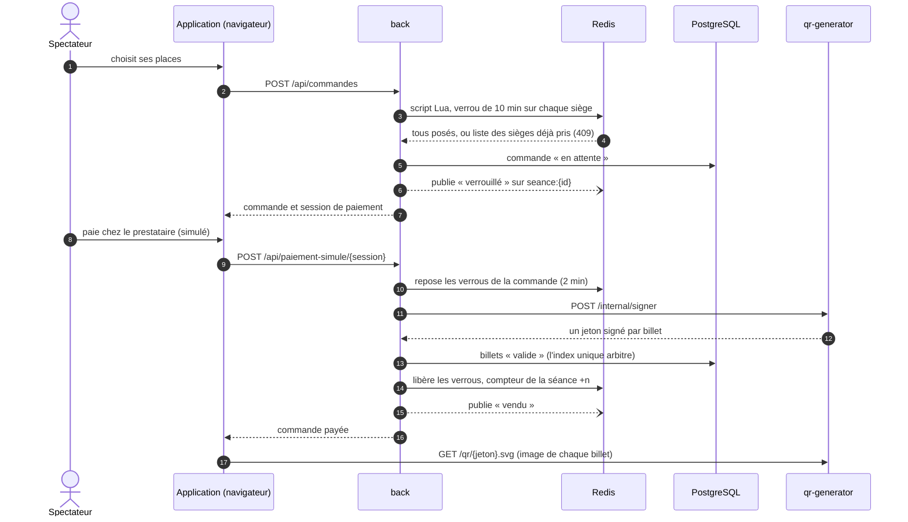
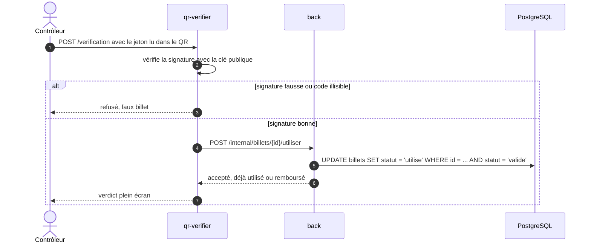
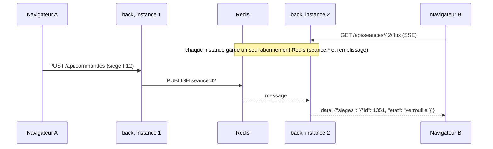

# Documentation technique de CinetINT

Ce document explique comment la billetterie est construite : les services, les technologies, les échanges entre services, les données, la sécurité et le déploiement. Le [README](../README.md) résume le besoin, les fonctionnalités et le plan d'action.


## Sommaire

1. [Les services](#1-les-services)
2. [Technologies utilisées](#2-technologies-utilisées)
3. [Organisation du dépôt](#3-organisation-du-dépôt)
4. [Les échanges pas à pas](#4-les-échanges-pas-à-pas)
5. [Données](#5-données)
6. [Sécurité](#6-sécurité)
7. [Configuration](#7-configuration)
8. [Déploiement](#8-déploiement)
9. [Tests](#9-tests)
10. [Écarts avec la spécification de départ](#10-écarts-avec-la-spécification-de-départ)

---

## 1. Les services

L'application est découpée en quatre services qui ne partagent aucun code et ne se parlent qu'en HTTP. Chacun tourne dans son propre conteneur Docker.

| Service | Ce qu'il fait | Ce qu'il détient | Qui l'appelle |
|---|---|---|---|
| **front** | Rend côté serveur l'accueil, les fiches films et la borne ; sert l'application React (plan de salle, paiement, billets, contrôle, back-office) | Rien : il lit le catalogue dans l'API | Le navigateur |
| **back** | Toute la logique de billetterie : catalogue, verrous de sièges, commandes, paiement, remboursements, back-office, flux temps réel, import de la programmation | La base PostgreSQL et Redis | Le navigateur, le front, le qr-verifier |
| **qr-generator** | Signe chaque billet, dessine le QR code (SVG) et le PDF des billets | La clé privée Ed25519 (fichier dans un volume) | Le back (signature, PDF), le navigateur (image du QR), le qr-verifier (clé publique) |
| **qr-verifier** | Au contrôle d'entrée, vérifie la signature puis demande au back de marquer le billet utilisé | La clé publique seulement | L'application du contrôleur |

PostgreSQL et Redis tournent aussi en conteneurs, mais seul le back y accède. Aucun autre service ne touche directement une donnée.

**Pourquoi deux services pour les QR codes ?** Le vérificateur ne détient que la clé publique : il sait reconnaître un vrai billet, jamais en fabriquer un. On peut donc le multiplier ou le rapprocher des entrées sans risque, une fuite de ce service ne permet pas d'émettre de faux billets. La clé privée ne quitte pas le qr-generator, que seul le back appelle pour signer.

## 2. Technologies utilisées

| Couche | Technologie | Version | Rôle dans le projet |
|---|---|---|---|
| Langage serveur | Python | 3.13 | Les quatre services |
| Framework web | FastAPI + Uvicorn | 0.142 / 0.54 | API REST, documentation OpenAPI automatique, flux SSE natifs |
| Pages serveur | Jinja2 | 3.1 | Accueil, fiches films, borne, rendus par le front |
| Interface | React + React Router | 19 / 8 | Plan de salle, paiement, billets, contrôle, back-office |
| Outillage front | Vite, TypeScript | 8 / 6 | Compilation et typage de l'application |
| Lecture des QR | barcode-detector (ZXing compilé en WebAssembly) | 3.2 | Scan à la caméra du téléphone du contrôleur |
| Accès aux données | SQLAlchemy (asyncio) avec le pilote asyncpg | 2.1 | Modèle, requêtes, transactions |
| Base de données | PostgreSQL | 17 | Source de vérité, contrainte d'unicité partielle |
| Cache et messages | Redis, client redis-py | 8 / 8.1 | Verrous à expiration, compteurs, pub/sub |
| Signature | cryptography (Ed25519) | 50 | Signature et vérification des billets |
| QR et PDF | segno, fpdf2 | 1.6 / 2.8 | Image du QR code, billets imprimables |
| Authentification | PyJWT, pwdlib (Argon2) | 2.15 / 0.3 | Jetons du personnel, mots de passe hachés |
| Appels HTTP | httpx | 0.28 | Appels entre services, import de la programmation |
| Images | Pillow | 12.3 | Teinte dominante des affiches (fond des fiches films) |
| Conteneurs | Docker, Docker Compose | | Un conteneur par service, lancement en une commande |
| Frontal | nginx, certificat Let's Encrypt | | HTTPS et routage par préfixe en production |
| Tests | pytest, pytest-asyncio | 9 / 1.4 | Tests unitaires et tests de parcours contre une vraie base |

Polices : Barlow, Barlow Condensed et Barlow Semi Condensed (licence OFL), intégrées au build du front par les paquets `@fontsource`, sans appel à un service extérieur.

## 3. Organisation du dépôt

```
back/                       API de billetterie
  app/
    main.py                 démarrage, routes, sonde /api/sante
    config.py               variables d'environnement
    models.py               tables (SQLAlchemy)
    routes/                 catalogue, commandes, admin, auth, interne
    verrous.py              verrous de sièges (scripts Lua dans Redis)
    remplissage.py          compteurs de places vendues
    temps_reel.py           abonnement Redis unique et flux SSE
    tarifs.py               moteur de tarification
    paiement.py             interface du prestataire et prestataire simulé
    qr_client.py            appels au qr-generator
    programmation_cgr.py    import de la programmation réelle
    initialisation.py       schéma, salles, tarifs, tâche horaire
  tests/
qr-generator/               signature Ed25519, QR code, PDF
qr-verifier/                vérification, mode dégradé
front/
  server/                   FastAPI + Jinja : pages rendues côté serveur
  web/                      application React (Vite)
docs/                       cette documentation et le schéma
docker-compose.yml          les six conteneurs et les profils de test
```

## 4. Les échanges pas à pas

### Réserver et payer



Trois garde-fous se succèdent au moment du paiement :

- si le délai de paiement est dépassé, le paiement est refusé et les places sont remises en vente ;
- juste avant d'émettre les billets, le back repose les verrous de la commande : si un autre spectateur a pris une des places entre-temps, rien n'est émis ;
- si malgré tout deux commandes arrivaient à écrire la même place, l'index unique de la base refuse la seconde, qui est annulée.

### Contrôler un billet à l'entrée



Le passage de « valide » à « utilisé » tient en une seule requête SQL : deux scans simultanés du même billet ne peuvent pas réussir tous les deux. Chaque passage est inscrit au journal des contrôles, faux billets compris.

**Mode dégradé.** Si le back ne répond plus, le vérificateur accepte sur la seule signature (les faux restent bloqués) et refuse une deuxième présentation du même billet pendant la panne. Il retente les passages en attente toutes les 10 secondes ; quand le back revient, une double entrée découverte à ce moment est signalée dans ses journaux.

### Le temps réel entre plusieurs instances



Le plan de salle et le tableau du gérant se mettent à jour sans recharger la page, quelle que soit l'instance du back qui a traité la vente. Un verrou qui expire de lui-même dans Redis ne produit pas d'événement : le plan se relit en entier toutes les 30 secondes pour le rattraper.

### Rembourser

Le spectateur (depuis le lien de sa commande) ou le gérant demande le remboursement d'un billet. Le back verrouille la ligne du billet (`SELECT ... FOR UPDATE`), refuse s'il est déjà utilisé ou remboursé, vérifie le délai (60 minutes avant la séance par défaut ; le gérant, lui, peut rembourser après ce délai), demande le remboursement au prestataire, passe le billet à « remboursé », décrémente le compteur et publie « libre » : la place est aussitôt de nouveau en vente. Le verrou de ligne empêche un scan et un remboursement simultanés de se croiser.

### Importer la programmation réelle

Au démarrage puis toutes les heures, le back lit l'API publique du site du CGR Évry 2 (films, affiches, synopsis, séances de la semaine). Les nouvelles séances sont placées dans la première de nos six salles libre à cet horaire, ménage compris, avec un quota par film et par jour pour garder les proportions du programme d'origine. Une séance déjà importée ne bouge plus, car des billets ont pu être vendus.

Si la source ne répond pas, la programmation en place est conservée ; s'il n'y a plus aucune séance à venir (premier démarrage sans réseau, par exemple), le back génère une semaine fictive. Plusieurs instances peuvent démarrer ensemble : un verrou consultatif PostgreSQL garantit qu'une seule importe à la fois.

Pour que les plans de salle ne soient pas vides à la démonstration, chaque nouvelle séance reçoit des ventes simulées, enregistrées comme des ventes aux bornes et calées sur le taux de remplissage annoncé par la source quand il est connu. Ce sont des billets en base (sans QR code), comptés comme les autres dans le remplissage.

## 5. Données

### Tables

| Table | Contenu | Contraintes utiles |
|---|---|---|
| `salles` | nom, capacité | |
| `sieges` | salle, rang, numéro, position x/y, accès fauteuil | unique (salle, rang, numéro) |
| `films` | titre, réalisation, durée, genre, synopsis, type de production, affiche, teinte, identifiant chez la source | identifiant source unique |
| `evenements` | nom, description | |
| `seances` | film, salle, début, version, événement, identifiant source | identifiant source unique |
| `categories` | code, libellé, ordre, active | |
| `regles_tarifaires` | libellé, prix, priorité, jours, type de production, catégorie, événement, active | |
| `commandes` | référence, séance, lignes choisies (JSON), montant, statut, session du prestataire, expiration | référence unique, statut contrôlé |
| `billets` | commande, séance, siège, catégorie, tarif et prix payés, statut, jeton signé, dates d'utilisation et de remboursement | **unique (séance, siège) pour les billets valides ou utilisés**, statut contrôlé |
| `controles` | billet, résultat, poste, horodatage | |
| `parametres` | clé, valeur, libellé | |
| `comptes` | identifiant, mot de passe haché, rôle | identifiant unique |

### Clés Redis

| Clé ou canal | Exemple | Contenu | Durée de vie |
|---|---|---|---|
| `verrou:{<séance>}:<siège>` | `verrou:{42}:1351` | identifiant de la commande qui bloque le siège | durée du blocage (10 min par défaut) |
| `remplissage:<séance>` | `remplissage:42` | nombre de places vendues | sans expiration, recalculable depuis la base |
| canal `seance:<séance>` | `seance:42` | changements d'état des sièges | message |
| canal `remplissage` | | nouveau total vendu d'une séance | message |

Les accolades de `verrou:{42}:...` forment un « hash tag » : toutes les clés d'une même séance tombent sur le même nœud si Redis passe en cluster, ce qui garde valide le script Lua qui pose tous les verrous d'une commande d'un coup.

## 6. Sécurité

- **Billets.** Jeton `CIN1.<contenu>.<signature>` signé en Ed25519, sans donnée personnelle. Un jeton modifié ou signé avec une autre clé est refusé au contrôle, et le qr-generator refuse même d'en dessiner le QR code.
- **Personnel.** Connexion par identifiant et mot de passe (haché en Argon2), puis jeton JWT valable 12 heures. Le back-office exige le rôle gérant ; le contrôle accepte gérant et contrôleur. Le flux SSE du gérant reçoit le jeton en paramètre, car un `EventSource` ne sait pas envoyer d'en-tête.
- **Entre services.** Les routes `/internal/...` exigent l'en-tête `X-Service-Token` et ne sont jamais exposées par nginx (réponse 404 depuis l'extérieur).
- **Paiement.** Aucune donnée de carte ne passe par nos services, le prestataire s'en charge.
- **Réseau.** Les ports des conteneurs ne sont publiés que sur 127.0.0.1 ; en production, seul nginx est joignable, en HTTPS.
- **Secrets.** Mots de passe, jetons et clé privée viennent de l'environnement ou d'un volume, jamais du dépôt (`.env` est ignoré par git).

## 7. Configuration

Chaque service lit ses réglages dans ses variables d'environnement, que `docker-compose.yml` renseigne à partir du fichier `.env`.

| Service | Variable | Rôle |
|---|---|---|
| back | `DATABASE_URL`, `REDIS_URL` | Accès à PostgreSQL et Redis |
| back, qr-verifier | `QR_GENERATOR_URL` | Adresse interne du qr-generator |
| back, qr-generator, qr-verifier | `SERVICE_TOKEN` | Secret partagé des routes `/internal` |
| back, qr-verifier | `JWT_SECRET` | Clé des jetons du personnel |
| back | `JWT_DUREE_HEURES` | Durée de validité d'une connexion (12 par défaut) |
| back | `GERANT_MOT_DE_PASSE`, `CONTROLEUR_MOT_DE_PASSE` | Mots de passe du personnel, réappliqués à chaque démarrage |
| back | `DONNEES_DEMO` | Crée salles, tarifs et programmation au premier démarrage (désactivé pour les tests) |
| back | `PROGRAMME_SOURCE` | `cgr` (programmation réelle), `demo` (semaine fictive) ou `aucune` |
| back | `PROGRAMME_API`, `PROGRAMME_CINEMA` | Adresse de la source et code du cinéma (B0059, CGR Évry 2) |
| back, qr-generator, qr-verifier | `CORS_ORIGINS` | Origines autorisées quand le navigateur appelle un service directement |
| qr-generator | `CLE_PRIVEE_FICHIER` | Emplacement de la clé privée, créée au premier démarrage |
| qr-verifier | `BACK_URL` | Adresse interne du back |
| qr-verifier | `CLE_PUBLIQUE` | Clé publique en PEM (sinon lue auprès du qr-generator) |
| front | `API_INTERNE` | Adresse du back pour le rendu serveur |
| front | `URL_API`, `URL_QR`, `URL_VERIFICATION` | Adresses vues par le navigateur (vides = même domaine) |

## 8. Déploiement

### En local

```bash
cp .env.example .env
docker compose up --build
```

Le site répond sur http://localhost:8080. Chaque service expose sa documentation sur son port : http://localhost:8000/api/docs, http://localhost:8001/qr/docs et http://localhost:8002/verification/docs.

### En production

La même composition tourne sur le serveur, derrière un nginx qui fait le HTTPS (Let's Encrypt) et route par préfixe : `/` vers le front, `/api` vers le back (tampon coupé pour les flux SSE), `/qr` vers le qr-generator, `/verification` vers le qr-verifier. `/internal` renvoie 404. Mise à jour, dans le dossier du dépôt sur le serveur :

```bash
git pull
docker compose up -d --build
```

### Vers Kubernetes

Le découpage est déjà celui d'un déploiement Kubernetes ; le passage consistera surtout à traduire la composition.

| Aujourd'hui (Compose) | Demain (Kubernetes) |
|---|---|
| un service `front`, `back`, `qr-generator`, `qr-verifier` | un `Deployment` et un `Service` chacun ; plusieurs répliques du back avec un `HorizontalPodAutoscaler` |
| nginx en frontal, routage par préfixe | un `Ingress` avec les mêmes règles, sans `/internal` |
| fichier `.env` | `Secret` (JWT, jeton de service, clé Ed25519 montée en fichier) et `ConfigMap` |
| volumes `postgres` et `cles` | `StatefulSet` PostgreSQL avec `PersistentVolumeClaim` ; volume ou `Secret` pour la clé |
| sondes appelées à la main | `readinessProbe` et `livenessProbe` sur `/api/sante`, `/qr/sante`, `/verification/sante`, `/sante` |
| réseau Docker | `NetworkPolicy` : seuls les services appellent `/internal`, seul le back parle à la base |

Le back est déjà prêt à tourner en plusieurs exemplaires : aucune session en mémoire, verrous et compteurs dans Redis, un seul abonnement Redis par instance, création du schéma et import protégés par un verrou consultatif PostgreSQL. Seul le qr-verifier garde un état en mémoire, la liste des passages à rejouer pendant une panne du back.

## 9. Tests

```bash
docker compose --profile tests run --rm back-tests
docker compose --profile tests run --rm qr-generator-tests
docker compose --profile tests run --rm qr-verifier-tests
```

| Suite | Ce qui est vérifié |
|---|---|
| back, tarifs | prix selon le jour (à l'heure de Paris), le type de film et la catégorie ; tarif unique d'un événement ; règle la plus précise à priorité égale ; règle inactive ignorée |
| back, parcours | achat complet et PDF ; 25 réservations simultanées du même siège (une seule réussit) ; refus d'un doublon par la base ; annulation qui libère les places ; paiement refusé après expiration ; nombre de places limité ; entrée unique au contrôle puis remboursement impossible ; routes internes fermées ; remplissage qui suit les ventes ; back-office réservé au gérant |
| back, programmation | version VF ou VOST ; identifiants de séance courts et stables ; placement dans une salle libre ; grande salle pour l'écran ICE ; lecture d'une fiche film de la source |
| qr-generator | jeton vérifiable avec la seule clé publique ; jeton modifié refusé ; image SVG ; PDF ; routes internes protégées ; clé conservée entre deux démarrages |
| qr-verifier | billet accepté une seule fois ; billet remboursé refusé ; faux billet signé avec une autre clé ; code illisible ; accès réservé au personnel ; mode dégradé quand le back ne répond plus |

Les tests du back tournent contre un vrai PostgreSQL et un vrai Redis (base dédiée `cinetint_tests`), pour éprouver les vraies contraintes et les vrais scripts Lua.

## 10. Écarts avec la spécification de départ

| Prévu dans la spécification | Réalisé | Raison |
|---|---|---|
| File de messages pour envoyer les billets par e-mail et appeler le remboursement | Pas d'e-mail ; remboursement appelé directement par l'API | Le client veut un billet affiché ou en fichier, sans compte : il s'affiche après paiement et se télécharge en PDF. Le prestataire simulé répond immédiatement ; une file (et un worker) servira avec le vrai prestataire, pour réessayer un remboursement en échec |
| Application de scan installable, avec cache local, qui fonctionne réseau coupé | Page de contrôle dans l'application web ; mode dégradé dans le qr-verifier | Le contrôle continue si le back ou la base tombe. La coupure du réseau du téléphone lui-même n'est pas encore couverte : prochaine étape, vérifier la signature dans le navigateur avec la clé publique |
| Signature HMAC-SHA256 ou asymétrique | Ed25519 (asymétrique) | Le vérificateur n'a besoin d'aucun secret |
